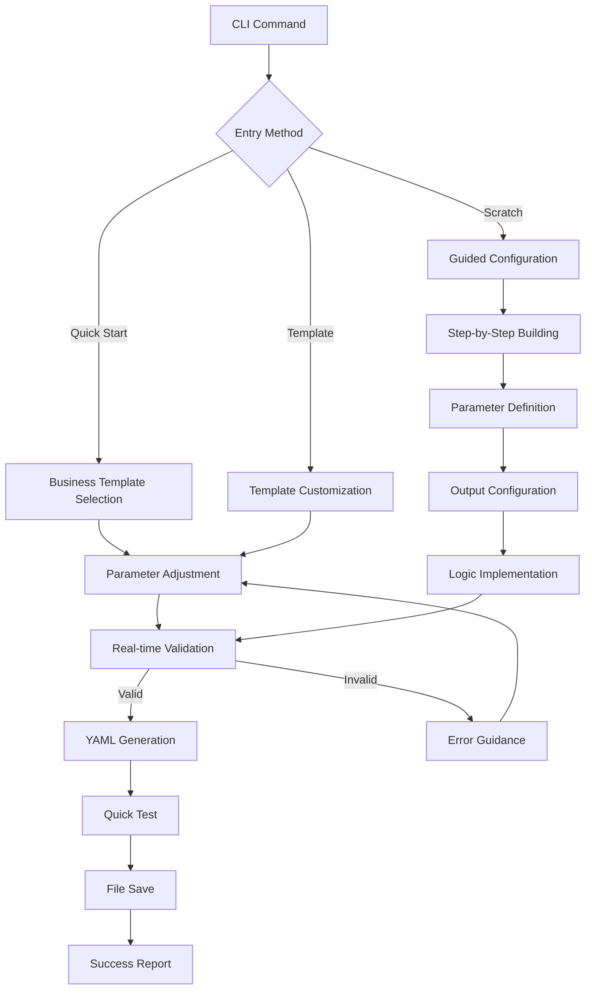

# Interactive Definition Builder Design

## Problem Statement

AI agents and developers need an intuitive, guided approach to create complex Monte Carlo simulations without manually writing YAML configurations. The current `config-builder.ts` provides basic interactive configuration, but lacks:

1. **Guided Workflow**: No step-by-step simulation creation process
2. **Real-time Validation**: Configuration errors discovered only after completion
3. **Template Integration**: Limited access to business intelligence templates 
4. **Agent Optimization**: No patterns designed specifically for AI workflow efficiency
5. **Interactive Testing**: No ability to validate configurations during creation

**Business Need**: Enable agents to generate sophisticated business intelligence simulations through guided interaction, reducing configuration errors and improving simulation quality.

## User Stories

### Primary Agent User Story
**As an AI agent generating business simulations,**
**I want a guided, interactive workflow to create validated simulation configurations,**
**So that I can produce working YAML files without manual debugging.**

**Acceptance Criteria:**
- Agent can complete simulation creation in < 5 interaction steps
- Real-time validation prevents invalid configurations
- Generated YAML passes all framework validation tests
- Business intelligence templates are easily accessible and customizable

### Secondary Developer User Story
**As a business analyst using the CLI,**
**I want to define simulations interactively with immediate feedback,**
**So that I can create complex analyses without deep YAML knowledge.**

**Acceptance Criteria:**
- Interactive prompts guide through all required configuration
- Live preview shows generated YAML structure
- Quick test validates configuration before saving
- Integration with existing template library

## Technical Design

### Architecture Overview

```
┌─────────────────────────────────────────────────────┐
│                Interactive Definition Builder        │
├─────────────────────────────────────────────────────┤
│  ┌─────────────────┐  ┌─────────────────────────────┐ │
│  │   CLI Command   │  │    Guided Workflow Engine   │ │
│  │  studio define  │  │  - Step validation          │ │
│  │                 │  │  - Progress tracking        │ │
│  └─────────────────┘  │  - Context awareness        │ │
│           │            └─────────────────────────────┘ │
│           ▼                         │                  │
│  ┌─────────────────┐                ▼                  │
│  │Template Library │  ┌─────────────────────────────┐ │
│  │   Integration   │  │   Interactive Components    │ │
│  │                 │  │  - Inquirer.js prompts      │ │
│  └─────────────────┘  │  - Real-time validation     │ │
│           │            │  - YAML preview             │ │
│           ▼            │  - Quick test execution     │ │
│  ┌─────────────────┐  └─────────────────────────────┘ │
│  │Config Generation│                 │                 │
│  │& Validation     │                 ▼                 │
│  │                 │  ┌─────────────────────────────┐ │
│  └─────────────────┘  │        Output Handler        │ │
│                       │  - YAML file generation      │ │
│                       │  - Validation reporting      │ │
│                       │  - Success confirmation      │ │
│                       └─────────────────────────────┘ │
└─────────────────────────────────────────────────────┘
```

### Component Design

#### 1. Definition Studio Controller (`definition-studio.ts`)
```typescript
export class InteractiveDefinitionStudio {
  private configBuilder: InteractiveConfigBuilder
  private templateLibrary: TemplateLibrary
  private validator: ConfigurationValidator
  
  async createSimulation(options: StudioOptions): Promise<string>
  async quickStart(): Promise<SimulationConfig>
  async customizeFromTemplate(templateId: string): Promise<SimulationConfig>
  async buildFromScratch(): Promise<SimulationConfig>
  
  // Real-time validation
  private async validateStep(step: ConfigStep, data: any): Promise<ValidationResult>
  private async previewConfiguration(partial: Partial<SimulationConfig>): Promise<string>
}
```

#### 2. Guided Workflow Engine
```typescript
interface WorkflowStep {
  id: string
  title: string
  description: string
  validator: (data: any) => Promise<ValidationResult>
  nextStep: (data: any) => string | null
}

export class GuidedWorkflow {
  private steps: Map<string, WorkflowStep>
  private context: WorkflowContext
  
  async executeWorkflow(startStep: string): Promise<SimulationConfig>
  async jumpToStep(stepId: string): Promise<void>
  async validateCurrentStep(): Promise<ValidationResult>
}
```

### API Design

#### CLI Integration
```bash
# Main command
npm run cli studio define

# Quick start options
npm run cli studio define --quick-start
npm run cli studio define --template <template-id>
npm run cli studio define --from-example <example-path>

# Advanced options
npm run cli studio define --interactive --output <path> --validate
```

#### Configuration Flow
1. **Entry Point Selection**
   - Quick start (business intelligence templates)
   - Template customization (existing business templates)
   - Build from scratch (advanced users)

2. **Guided Configuration**
   - Basic simulation information
   - Parameter definition with business tips
   - Output metric selection
   - Business logic implementation
   - Validation and testing

3. **Output Generation**
   - YAML file creation
   - Validation report
   - Quick test execution
   - Usage guidance

### Data Flow



## Agent Experience Design

### Workflow Optimization

#### 1. Natural Language Integration Points
```typescript
interface AgentContext {
  intent: 'roi_analysis' | 'investment_planning' | 'growth_modeling'
  businessContext: string
  keyParameters: string[]
  expectedOutputs: string[]
}

// Agent-optimized entry point
export async function generateFromIntent(context: AgentContext): Promise<SimulationConfig>
```

#### 2. Configuration Simplicity
- **Smart Defaults**: Business intelligence templates pre-populated
- **Context Awareness**: Previous choices inform subsequent options
- **Validation Feedback**: Immediate, actionable error messages
- **Progress Indicators**: Clear workflow completion status

#### 3. Error Handling Strategy
```typescript
interface ValidationError {
  field: string
  message: string
  suggestion: string
  businessContext?: string
  exampleValue?: any
}

// Agent-friendly error responses
export class AgentErrorHandler {
  formatForAgent(errors: ValidationError[]): string
  suggestCorrections(config: Partial<SimulationConfig>): string[]
  provideBusinessContext(parameterKey: string): string
}
```

### Template Integration Pattern
```typescript
export class AgentTemplateManager {
  async suggestTemplate(businessIntent: string): Promise<BusinessTemplate[]>
  async customizeForAgent(template: BusinessTemplate, context: AgentContext): Promise<SimulationConfig>
  async generateBusinessGuidance(config: SimulationConfig): Promise<string>
}
```

## Implementation Plan

### Cost-Benefit Analysis
**Total Development Cost**: $50-$70 (Claude Code)  
**Traditional Development Cost**: $5,000-$25,000  
**Cost Savings**: 99.1-99.7%  
**ROI**: Exceptional value for sophisticated interactive simulation system

### Phase 1: Core Interactive Engine (Cost: $10.50-$43.40)
**Sessions Required**: 3-4 sessions  
**Deliverables:**
- `definition-studio.ts` controller implementation
- Guided workflow engine with step validation
- CLI command integration (`studio define`)
- Basic template selection and customization

**Testing Strategy:**
- Unit tests for workflow engine components
- Integration tests with existing config-builder.ts
- CLI command validation tests

### Phase 2: Agent Optimization Features (Cost: $10.95-$45.00)
**Sessions Required**: 3-4 sessions  
**Deliverables:**
- Agent-optimized APIs and context handling
- Real-time YAML validation and preview
- Business intelligence template integration
- Error handling with business context

**Testing Strategy:**
- Agent workflow simulation tests
- Template customization validation
- Business context accuracy verification

### Phase 3: Enhanced User Experience (Cost: $0.57-$3.46)
**Sessions Required**: 1-2 sessions  
**Deliverables:**
- Quick test execution during configuration
- Progress tracking and step navigation
- Advanced customization options
- Performance optimization

**Testing Strategy:**
- End-to-end workflow tests
- Performance benchmarks for large configurations
- User experience validation with example scenarios

### Budget Recommendations
- **Conservative Budget**: $75 (includes 25% buffer)
- **Realistic Budget**: $60 (typical Claude Code patterns)
- **Minimum Viable**: $40 (core functionality only)

### Migration Strategy
- **Backward Compatibility**: Existing `config-builder.ts` remains functional
- **Gradual Enhancement**: New features added without breaking changes
- **Template Migration**: Existing templates automatically compatible
- **Documentation Updates**: Agent-focused guides and examples

### Performance Considerations
- **Lazy Loading**: Templates loaded on demand
- **Validation Caching**: Repeated validations cached for performance
- **Streaming Output**: Large YAML previews streamed for responsiveness
- **Memory Management**: Configuration context cleared after completion

## Success Criteria

### Measurable Outcomes

#### 1. Agent Usability Metrics
- **Configuration Completion Rate**: >95% of started workflows completed
- **Error Reduction**: <5% of generated configurations fail validation
- **Workflow Time**: Average completion time <3 minutes for template-based
- **Agent Satisfaction**: Positive feedback on guided workflow efficiency

#### 2. Business Intelligence Value
- **Template Utilization**: >80% of configurations use business templates
- **Parameter Accuracy**: Business parameters follow industry benchmarks
- **Simulation Quality**: Generated simulations pass comprehensive validation
- **Business Context**: Configurations include relevant business intelligence

#### 3. Framework Integration Success
- **API Compatibility**: 100% compatibility with existing framework
- **Performance Impact**: <200ms overhead for interactive features
- **Code Quality**: All components maintain >90% test coverage
- **Documentation Coverage**: Complete API documentation for agent usage

### Validation Approach
- **Automated Testing**: Comprehensive test suite for all workflows
- **Agent Simulation**: Automated agent usage pattern validation
- **Business Template Testing**: Validation against real business scenarios
- **Performance Benchmarking**: Regular performance regression testing

## Dependencies

### Prerequisites (All Met)
- ✅ Clean technical foundation (technical debt resolved)
- ✅ BusinessSimulation exports available
- ✅ Existing config-builder.ts architecture
- ✅ Inquirer.js integration working
- ✅ Template library implementation complete

### Integration Requirements
- **CLI Framework**: Extension of existing CLI command structure
- **Configuration System**: Full compatibility with YAML validation
- **Template System**: Integration with existing business template library
- **Testing Framework**: Extension of existing test suite

## Risks & Mitigation

### Technical Risks

#### 1. **Complexity Management**
**Risk**: Interactive workflow becomes too complex for agent usage
**Mitigation**: 
- Start with minimal viable workflow
- Iterative complexity addition based on agent feedback
- Maintain simple API surface for basic use cases

#### 2. **Performance Impact**
**Risk**: Real-time validation impacts user experience
**Mitigation**:
- Implement validation debouncing
- Use caching for repeated validations
- Profile and optimize critical paths

#### 3. **Template Compatibility**
**Risk**: Existing templates may not work well with interactive workflow
**Mitigation**:
- Extensive testing with current template library
- Template enhancement as needed
- Fallback to basic configuration builder

### Business Risks

#### 1. **Agent Adoption**
**Risk**: Agents prefer existing configuration methods
**Mitigation**:
- Maintain backward compatibility
- Provide clear migration benefits
- Iterative improvement based on usage patterns

#### 2. **Maintenance Overhead**
**Risk**: Interactive features increase codebase complexity
**Mitigation**:
- Modular design with clear interfaces
- Comprehensive test coverage
- Documentation for future maintainers

## Next Steps

1. **Design Review**: Review this document with stakeholders
2. **Implementation Planning**: Break down into detailed task list
3. **Environment Setup**: Prepare development environment
4. **Phase 1 Implementation**: Begin with core interactive engine
5. **Testing Strategy**: Implement test infrastructure alongside development

---

*This design document serves as the foundation for implementing the Interactive Definition Builder, focusing on agent workflow optimization and business intelligence integration while maintaining framework quality standards.*