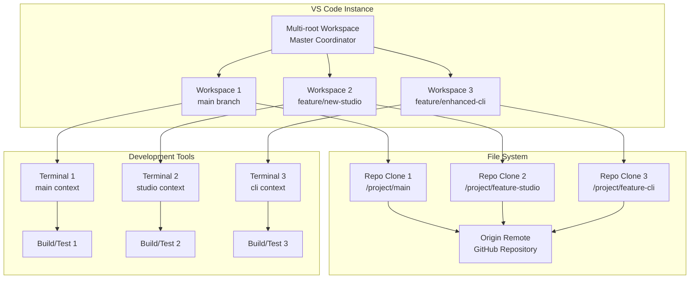

# Multi-Branch Concurrent Development Workflow Design

## Problem Statement

### Current Development Challenge
As a CTO working with AI assistants on the Monte Carlo simulation framework, there's a need to work on multiple feature branches simultaneously within VS Code or similar editors. Traditional git workflows force context switching between branches, losing work-in-progress state and requiring mental overhead to resume different development streams.

### The Vision
Enable simultaneous development across multiple branches with:
- **Isolated workspaces** for each branch without losing IDE state
- **Parallel feature development** without branch switching overhead
- **Context preservation** for each development stream
- **Efficient resource utilization** without duplicate project complexity

## User Stories

### As a CTO/Technical Lead
- **US1**: I want to review a feature branch while continuing development on main
- **US2**: I want to compare implementations across branches side-by-side
- **US3**: I want to test different approaches simultaneously without losing context
- **US4**: I want AI assistants to work on different branches independently

### As an AI Development Assistant
- **US5**: I want to maintain separate context per branch without cross-contamination
- **US6**: I want to run tests and builds independently per branch
- **US7**: I want to understand which branch context I'm operating in

### As a Development Team Member
- **US8**: I want to cherry-pick features across branches efficiently  
- **US9**: I want to resolve merge conflicts with full context from both branches
- **US10**: I want to maintain clean commit history across parallel work streams

## Technical Design

### Architecture Overview



## Git Worktrees: The Foundation Technology

### What Are Git Worktrees?

Git worktrees enable **multiple working directories** attached to a single git repository. Instead of switching branches and losing working state, different branches can be checked out in separate directories simultaneously.

```bash
# Traditional workflow (context switching overhead)
git checkout main          # Work on main
# ... make changes ...
git checkout feature-a     # Lose context, switch to feature
# ... work on feature ...
git checkout main          # Switch back, lose feature context

# Worktree workflow (parallel development)
git worktree add ../feature-a feature-a    # Create separate directory
# Now you have:
# ./project/        (main branch)
# ../feature-a/     (feature-a branch)
# Work in both simultaneously without context loss!
```

### How Worktrees Work Internally

```bash
# Single repository with multiple working directories
monte-carlo-simulator/.git/         # Main git repository
├── worktrees/
│   ├── interactive-studio/         # Worktree metadata
│   └── enhanced-cli/              # Worktree metadata
├── objects/                       # Shared git objects (efficient storage)
├── refs/                          # Shared references
└── config                         # Shared configuration

monte-carlo-simulator/             # Main working directory (main branch)
├── src/
├── examples/
├── package.json
└── .git                          # Points to main .git/

monte-carlo-studio/               # Studio feature worktree
├── src/                         # Independent working files
├── examples/
├── package.json
└── .git                         # Points to main .git/worktrees/interactive-studio/

monte-carlo-cli/                 # CLI feature worktree  
├── src/                        # Independent working files
├── examples/
├── package.json
└── .git                        # Points to main .git/worktrees/enhanced-cli/
```

### Key Worktree Benefits

#### **1. Shared Git History**
All worktrees share the same repository:
- **Objects shared** (commits, blobs, trees) - only ~10% storage overhead
- **Single fetch updates all** - one `git fetch` updates every worktree
- **Consistent view** - all branches visible from any worktree

#### **2. Independent Working States**
Each worktree maintains separate:
- **Working directory** - different files can be modified simultaneously
- **Index/staging area** - independent `git add` states per worktree
- **HEAD pointer** - different branches checked out
- **Branch state** - independent commits, merges, and rebases

#### **3. Resource Efficiency**
- **Storage**: ~10% overhead vs full clones (shared git objects)
- **Network**: Single fetch updates all worktrees efficiently
- **Speed**: No repository re-download, instant worktree creation

### Worktree Lifecycle Example

```bash
# 1. Create worktrees for parallel development
cd monte-carlo-simulator/
git worktree add ../monte-carlo-studio feature/interactive-studio
git worktree add ../monte-carlo-cli feature/enhanced-cli

# 2. Develop simultaneously across branches
# Terminal 1: Main branch
cd monte-carlo-simulator/
npm test && git commit -m "fix: resolve validation bug"

# Terminal 2: Studio feature (parallel development)
cd ../monte-carlo-studio/
npm run dev:studio && git commit -m "feat: add interactive interface"

# Terminal 3: CLI feature (parallel development)
cd ../monte-carlo-cli/  
npm run build:cli && git commit -m "feat: enhance parameter validation"

# 3. Cross-worktree operations
git worktree list                    # View all active worktrees
git fetch origin                     # Updates all worktrees
git log --oneline --all --graph      # See all branch history

# 4. Clean up when features complete
git worktree remove ../monte-carlo-studio
git worktree remove ../monte-carlo-cli
```

### Advanced Worktree Operations

```bash
# Create worktree for new branch
git worktree add ../monte-carlo-hotfix -b hotfix/urgent-validation-fix

# Move worktree to different location
git worktree move ../monte-carlo-studio ~/projects/studio-work

# Lock worktree to prevent accidental deletion
git worktree lock ../monte-carlo-studio

# Repair worktrees if paths change
git worktree repair

# List with detailed status
git worktree list --porcelain
```

### Worktree Limitations and Considerations

#### **Limitations**
- **One branch per worktree** - same branch cannot be checked out in multiple worktrees
- **Shared configuration** - .gitconfig settings affect all worktrees  
- **Submodule complexity** - requires careful handling across worktrees

#### **Best Practices**
- **Descriptive names**: `monte-carlo-feature-studio` vs generic `temp`
- **Consistent structure**: All worktrees in same parent directory
- **Clean up promptly**: Remove worktrees when features complete
- **Regular pruning**: Use `git worktree prune` to clean metadata

### Implementation Options

#### Option 1: Git Worktrees + Multi-Root VS Code Workspace (Recommended)
```json
// monte-carlo-development.code-workspace
{
  "folders": [
    {
      "name": "main", 
      "path": "../monte-carlo-main"
    },
    {
      "name": "studio-feature",
      "path": "../monte-carlo-feature-studio" 
    },
    {
      "name": "cli-enhancements",
      "path": "../monte-carlo-feature-cli"
    }
  ],
  "settings": {
    "terminal.integrated.cwd": "${workspaceFolder}",
    "git.enabled": true,
    "git.scanRepositories": ["../monte-carlo-*"]
  },
  "extensions": {
    "recommendations": [
      "ms-vscode.vscode-typescript-next",
      "bradlc.vscode-tailwindcss",  
      "ms-vscode.test-adapter-converter"
    ]
  }
}
```

**Advantages:**
- Native VS Code support 
- Shared extensions and settings
- Independent terminals per workspace
- Side-by-side file comparison
- Unified search across branches

#### Option 2: Git Worktree + Single VS Code
```bash
# Create worktrees for each branch
git worktree add ../feature-studio feature/interactive-studio
git worktree add ../feature-cli feature/enhanced-cli
git worktree add ../hotfix-validation hotfix/validation-fix

# VS Code opens in multi-root mode automatically
code monte-carlo-development.code-workspace
```

**Advantages:**
- Single repository history
- Shared git objects (space efficient)
- Native git integration
- Easy branch comparison

#### Option 3: Development Containers + Remote Development
```yaml
# .devcontainer/main/devcontainer.json
{
  "name": "Monte Carlo Main",
  "dockerComposeFile": "../docker-compose.yml",
  "service": "main-dev",
  "workspaceFolder": "/workspace/main",
  "customizations": {
    "vscode": {
      "settings": {
        "terminal.integrated.defaultProfile.linux": "bash"
      }
    }
  }
}
```

### File System Layout

```
monte-carlo-workspace/
├── monte-carlo-main/              # Main branch working directory
│   ├── .git/                     # Full git repository
│   ├── src/
│   ├── examples/
│   └── package.json
├── monte-carlo-feature-studio/    # Feature branch clone
│   ├── .git/                     # Linked to same origin
│   ├── src/
│   └── package.json
├── monte-carlo-feature-cli/       # Another feature branch
│   ├── .git/
│   ├── src/
│   └── package.json
└── monte-carlo-development.code-workspace
```

### Workflow Automation Scripts

```bash
#!/bin/bash
# scripts/setup-multi-branch.sh

# Setup multi-branch development environment
MAIN_DIR="monte-carlo-main"  
WORKSPACE_FILE="monte-carlo-development.code-workspace"

# Clone main branch
git clone https://github.com/rmurphey/monte-carlo-simulator.git $MAIN_DIR
cd $MAIN_DIR

# Create worktrees for active branches  
git fetch origin
git worktree add ../monte-carlo-feature-studio origin/feature/interactive-studio
git worktree add ../monte-carlo-feature-cli origin/feature/enhanced-cli

# Generate VS Code workspace file
cat > ../$WORKSPACE_FILE << EOF
{
  "folders": [
    {"name": "main", "path": "./$MAIN_DIR"},
    {"name": "studio-feature", "path": "./monte-carlo-feature-studio"},
    {"name": "cli-enhancements", "path": "./monte-carlo-feature-cli"}
  ],
  "settings": {
    "terminal.integrated.cwd": "\${workspaceFolder}",
    "git.enabled": true,
    "npm.packageManager": "npm"
  }
}
EOF

# Install dependencies in each workspace
cd ../$MAIN_DIR && npm install
cd ../monte-carlo-feature-studio && npm install  
cd ../monte-carlo-feature-cli && npm install

echo "✅ Multi-branch workspace ready!"
echo "Open: code $WORKSPACE_FILE"
```

## Agent Experience Design

### Context Awareness
```typescript
// AI Assistant Context Detection
interface BranchContext {
  workspaceName: string;
  branchName: string;
  workingDirectory: string;
  packageJsonPath: string;
  currentFeature: string;
  relatedBranches: string[];
}

class MultiWorkspaceContext {
  getCurrentContext(): BranchContext {
    const cwd = process.cwd();
    const branchName = execSync('git branch --show-current').toString().trim();
    const workspaceName = this.detectWorkspace(cwd);
    
    return {
      workspaceName,
      branchName, 
      workingDirectory: cwd,
      packageJsonPath: path.join(cwd, 'package.json'),
      currentFeature: this.parseFeatureFromBranch(branchName),
      relatedBranches: this.getRelatedBranches(branchName)
    };
  }
}
```

### Branch-Specific AI Behavior
1. **Context Isolation**: AI maintains separate conversation context per branch
2. **Feature-Aware**: AI understands which feature is being worked on
3. **Cross-Branch Operations**: AI can suggest merges, comparisons, cherry-picks
4. **Independent Testing**: AI runs tests specific to each branch context

### Workflow Optimization for AI Assistants

```bash
# Branch-aware command aliases
alias ai-main="cd monte-carlo-main && claude-code"
alias ai-studio="cd monte-carlo-feature-studio && claude-code"  
alias ai-cli="cd monte-carlo-feature-cli && claude-code"

# Quick workspace switching
function switch-workspace() {
  local workspace=$1
  cd "monte-carlo-$workspace" 
  export CURRENT_WORKSPACE="$workspace"
  export BRANCH_CONTEXT="$(git branch --show-current)"
}
```

## Implementation Plan

### **Detailed Development Roadmap**

#### **Phase 1: Foundation Setup (Days 1-7)**

**Day 1-2: Git Worktree Infrastructure**
- [ ] **Create worktree setup script** (`scripts/setup-multi-branch.sh`)
  ```bash
  #!/bin/bash
  # Automated worktree creation with validation
  ./scripts/setup-multi-branch.sh feature/interactive-studio feature/enhanced-cli
  ```
- [ ] **Implement worktree validation** - Check for conflicts, existing worktrees
- [ ] **Create cleanup script** - Safe removal with dependency checks
- [ ] **Test basic worktree operations** - Create, list, remove, repair

**Day 3-4: VS Code Multi-Root Workspace**
- [ ] **Generate workspace configuration** - Dynamic based on active worktrees
- [ ] **Configure per-workspace settings** - Terminal defaults, git integration
- [ ] **Setup workspace-specific tasks** - Build, test, lint per folder
- [ ] **Configure extension recommendations** - GitLens, Git Graph, etc.

**Day 5-6: Basic Development Workflow**
- [ ] **Test parallel development** - 3+ branches simultaneously  
- [ ] **Validate independent builds** - npm install, build, test per worktree
- [ ] **Verify terminal isolation** - Separate terminal contexts
- [ ] **Test file operations** - No cross-worktree interference

**Day 7: Documentation and Validation**
- [ ] **Create setup documentation** - Step-by-step user guide
- [ ] **Document troubleshooting** - Common issues and solutions
- [ ] **Validate resource usage** - Memory, CPU, disk space monitoring
- [ ] **Create demo workflow** - End-to-end example with screenshots

**Phase 1 Success Criteria:**
- ✅ 3+ branches open simultaneously in single VS Code instance
- ✅ Independent build processes without interference  
- ✅ <5 minute setup time for new multi-branch environment
- ✅ Resource overhead <20% vs single branch development

---

#### **Phase 2: Workflow Automation (Days 8-14)**

**Day 8-9: Automated Setup and Management**
- [ ] **Implement branch detection** - Automatically find active feature branches
- [ ] **Create workspace regeneration** - Update workspace when branches change
- [ ] **Add dependency synchronization** - Sync package.json changes across worktrees
- [ ] **Build safety checks** - Prevent simultaneous builds on same files

**Day 10-11: Cross-Branch Operations**
- [ ] **Branch comparison tools** - Side-by-side diff utilities
- [ ] **Cherry-pick helpers** - Safe cross-branch cherry-picking
- [ ] **Merge preview system** - Preview merges without affecting branches
- [ ] **Conflict detection** - Early warning for potential conflicts

**Day 12-13: Git Operations Safety**
- [ ] **Pre-commit hooks per worktree** - Prevent committing to wrong branch
- [ ] **Branch status indicators** - Visual branch state in terminals
- [ ] **Automatic fetch coordination** - Centralized fetch across worktrees
- [ ] **Stash management** - Per-worktree stash with clear labeling

**Day 14: Integration Testing**
- [ ] **Test complex workflows** - Hotfix while developing features
- [ ] **Validate merge scenarios** - Multiple feature merges
- [ ] **Test performance** - Large codebases, many branches
- [ ] **Document workflow patterns** - Best practices guide

**Phase 2 Success Criteria:**
- ✅ Safe cross-branch operations with conflict prevention
- ✅ Automated dependency management across worktrees
- ✅ Visual branch comparison and merge preview
- ✅ Zero accidental commits to wrong branches

---

#### **Phase 3: AI Assistant Integration (Days 15-21)**

**Day 15-16: Context Detection System**
- [ ] **Build branch context detector** - Identify current worktree and branch
- [ ] **Create context isolation** - Separate AI conversation contexts
- [ ] **Implement workspace routing** - Commands execute in correct worktree
- [ ] **Add context switching** - AI follows user between worktrees

**Day 17-18: AI-Aware Command System**
- [ ] **Workspace-specific commands** - npm scripts run in correct context
- [ ] **Cross-branch suggestions** - AI suggests relevant cross-branch operations
- [ ] **Context-aware file operations** - AI operates on correct file versions
- [ ] **Branch-aware code analysis** - AI analyzes appropriate branch context

**Day 19-20: Advanced AI Features**
- [ ] **Multi-branch code comparison** - AI compares implementations across branches
- [ ] **Merge conflict assistance** - AI helps resolve conflicts with context
- [ ] **Feature dependency tracking** - AI tracks dependencies between branches
- [ ] **Automated workflow suggestions** - AI suggests optimal development flow

**Day 21: AI Integration Validation**
- [ ] **Test context isolation** - No cross-branch contamination
- [ ] **Validate command routing** - 100% accuracy in workspace targeting
- [ ] **Test advanced features** - Merge assistance, dependency tracking
- [ ] **Performance optimization** - Minimize AI context switching overhead

**Phase 3 Success Criteria:**
- ✅ 95% accuracy in branch context detection
- ✅ Zero cross-branch context contamination
- ✅ AI provides relevant cross-branch operation suggestions
- ✅ Context switching overhead <2 seconds

---

#### **Phase 4: Advanced Features (Days 22-28)**

**Day 22-23: Visual Integration Tools**
- [ ] **Side-by-side branch comparison** - VS Code integration
- [ ] **Live merge conflict resolution** - Interactive conflict resolution
- [ ] **Branch topology visualization** - Visual branch relationship display
- [ ] **Worktree status dashboard** - Overview of all active worktrees

**Day 24-25: Automated Testing and CI**
- [ ] **Per-branch test isolation** - Independent test suites
- [ ] **Cross-branch integration tests** - Test branch compatibility
- [ ] **Automated quality gates** - Prevent merging broken code
- [ ] **Performance regression detection** - Catch performance issues early

**Day 26-27: Team Collaboration Features**
- [ ] **Shared workspace configuration** - Team-wide workspace templates
- [ ] **Branch assignment tracking** - Who's working on which branch
- [ ] **Merge queue management** - Coordinate team merge activities
- [ ] **Code review integration** - Review across multiple branches

**Day 28: Final Integration and Optimization**
- [ ] **Performance tuning** - Optimize resource usage
- [ ] **Error handling polish** - Graceful failure handling
- [ ] **Documentation completion** - Complete user and admin guides
- [ ] **Production readiness** - Final validation and deployment prep

**Phase 4 Success Criteria:**
- ✅ Visual diff tools integrated with VS Code
- ✅ Automated testing without cross-branch interference
- ✅ Team collaboration features functional
- ✅ Production-ready with comprehensive documentation

---

### **Implementation Scripts and Tools**

#### **Core Setup Script**
```bash
#!/bin/bash
# scripts/setup-multi-branch.sh
set -e

MAIN_DIR="monte-carlo-simulator"
WORKSPACE_FILE="monte-carlo-development.code-workspace"

echo "🚀 Setting up multi-branch development environment..."

# Validate git repository
if [ ! -d ".git" ]; then
    echo "❌ Not a git repository. Run from repository root."
    exit 1
fi

# Create worktrees for specified branches
BRANCHES=("$@")
if [ ${#BRANCHES[@]} -eq 0 ]; then
    echo "📋 Available branches:"
    git branch -r | grep -v HEAD | sed 's/origin\///' | sort
    echo "Usage: $0 <branch1> <branch2> ..."
    exit 1
fi

# Setup workspace structure
mkdir -p "../multi-branch-workspace"
cd "../multi-branch-workspace"

# Clone main repository if not exists
if [ ! -d "$MAIN_DIR" ]; then
    git clone "$(cd ../$(basename $PWD) && git config --get remote.origin.url)" $MAIN_DIR
fi

cd $MAIN_DIR

# Create worktrees for each branch
for branch in "${BRANCHES[@]}"; do
    worktree_name="monte-carlo-$(echo $branch | sed 's/feature\///' | sed 's/\//-/g')"
    worktree_path="../$worktree_name"
    
    if [ ! -d "$worktree_path" ]; then
        echo "📁 Creating worktree for $branch -> $worktree_path"
        git worktree add "$worktree_path" "$branch"
        
        # Install dependencies
        echo "📦 Installing dependencies in $worktree_path"
        (cd "$worktree_path" && npm install)
    else
        echo "✅ Worktree already exists: $worktree_path"
    fi
done

# Generate VS Code workspace
echo "⚙️  Generating VS Code workspace..."
cat > "../$WORKSPACE_FILE" << EOF
{
  "folders": [
    {"name": "Main", "path": "./$MAIN_DIR"},
$(for branch in "${BRANCHES[@]}"; do
    worktree_name="monte-carlo-$(echo $branch | sed 's/feature\///' | sed 's/\//-/g')"
    echo "    {\"name\": \"$(echo $branch | sed 's/feature\///' | tr '[:lower:]' '[:upper:]')\", \"path\": \"./$worktree_name\"},"
done | sed '$ s/,$//')
  ],
  "settings": {
    "terminal.integrated.cwd": "\${workspaceFolder}",
    "git.enabled": true,
    "git.scanRepositories": ["./monte-carlo-*"],
    "npm.packageManager": "npm"
  },
  "extensions": {
    "recommendations": [
      "ms-vscode.vscode-typescript-next",
      "eamodio.gitlens",
      "mhutchie.git-graph"
    ]
  }
}
EOF

# Show status
echo ""
echo "✅ Multi-branch environment ready!"
echo "📊 Active worktrees:"
git worktree list
echo ""
echo "🚀 Next steps:"
echo "1. Open VS Code: code ../$WORKSPACE_FILE"
echo "2. Each folder has independent terminals and build processes"
echo "3. Use 'git worktree list' to see all active worktrees"
echo "4. Clean up with: git worktree remove <path>"
```

#### **Branch Context Detection**
```typescript
// scripts/branch-context.ts
export interface WorktreeContext {
  isWorktree: boolean;
  worktreePath: string;
  branchName: string;
  mainRepoPath: string;
  relatedWorktrees: string[];
}

export function detectWorktreeContext(): WorktreeContext {
  const cwd = process.cwd();
  const gitDir = execSync('git rev-parse --git-dir', {cwd}).toString().trim();
  
  // Check if this is a worktree
  const isWorktree = gitDir.includes('/.git/worktrees/');
  
  if (isWorktree) {
    const worktreeName = path.basename(gitDir);
    const mainRepoPath = path.resolve(gitDir, '../../..');
    const branchName = execSync('git branch --show-current', {cwd}).toString().trim();
    
    // Find related worktrees
    const worktreeList = execSync('git worktree list --porcelain', {cwd: mainRepoPath})
      .toString()
      .split('\n\n')
      .filter(block => block.includes('worktree '))
      .map(block => {
        const lines = block.split('\n');
        const worktreePath = lines.find(l => l.startsWith('worktree '))?.replace('worktree ', '');
        const branch = lines.find(l => l.startsWith('branch '))?.replace('branch refs/heads/', '');
        return { worktreePath, branch };
      });
    
    return {
      isWorktree,
      worktreePath: cwd,
      branchName,
      mainRepoPath,
      relatedWorktrees: worktreeList.map(w => w.worktreePath).filter(p => p !== cwd)
    };
  }
  
  // This is main repository
  return {
    isWorktree: false,
    worktreePath: cwd,
    branchName: execSync('git branch --show-current', {cwd}).toString().trim(),
    mainRepoPath: cwd,
    relatedWorktrees: []
  };
}
```

### **Testing Strategy**

#### **Unit Tests**
- [ ] Worktree setup and teardown
- [ ] Context detection accuracy  
- [ ] Cross-branch operation safety
- [ ] Resource usage monitoring

#### **Integration Tests**  
- [ ] VS Code workspace generation
- [ ] Multi-branch development workflow
- [ ] AI assistant context isolation
- [ ] Team collaboration scenarios

#### **Performance Tests**
- [ ] Memory usage with 5+ worktrees
- [ ] Build time isolation
- [ ] Git operation performance
- [ ] AI context switching speed

#### **User Acceptance Tests**
- [ ] 5-minute setup validation
- [ ] Context switching <30 seconds
- [ ] Zero cross-branch contamination
- [ ] Team onboarding scenarios

## Success Criteria

### Measurable Outcomes

#### Developer Productivity
- **Context Switch Time**: Reduce from 2-3 minutes to <30 seconds
- **Parallel Development**: Support 3+ concurrent feature branches
- **Build Isolation**: Independent build/test processes per branch
- **Memory Usage**: <2GB additional overhead for multi-workspace setup

#### AI Assistant Effectiveness
- **Context Accuracy**: 95% correct branch context detection
- **Operation Safety**: Zero cross-branch contamination incidents
- **Command Routing**: 100% accurate workspace-specific command execution
- **Suggestion Quality**: Relevant cross-branch operation suggestions

#### Workflow Quality
- **Setup Time**: <5 minutes for new multi-branch environment
- **Merge Success**: Reduced merge conflicts through better context
- **Code Quality**: Maintain test coverage across all active branches
- **Team Coordination**: Clear branch state visibility for all team members

### Validation Approach

```bash
# Multi-branch validation tests
npm run test:multi-workspace   # Test isolation between workspaces
npm run test:context-detection # Verify AI context switching works
npm run test:git-operations    # Ensure safe cross-branch operations
npm run test:performance       # Validate resource usage stays reasonable
```

## Dependencies

### Prerequisites
- **VS Code**: Version 1.80+ with multi-root workspace support
- **Git**: Version 2.25+ for modern worktree features
- **Node.js**: 18+ for consistent package management across workspaces
- **Disk Space**: ~3x repository size for multiple working directories

### Integration Requirements
- **Existing CLI tools** must work independently in each workspace
- **Test runners** must not interfere across branches
- **Build artifacts** must be isolated per workspace
- **AI assistant tools** must detect and respect workspace boundaries

### External Dependencies
- **GitHub CLI** for streamlined branch management
- **VS Code Extensions**: GitLens, Git Graph for visual git operations
- **Terminal multiplexers** (optional): tmux or screen for persistent sessions

## Risks & Mitigation

### Technical Risks

#### Risk: Resource Consumption
**Impact**: High memory/CPU usage from multiple Node.js processes
**Probability**: High
**Mitigation**: 
- Use shared node_modules where possible
- Implement workspace sleeping for inactive branches
- Monitor resource usage with alerts

#### Risk: Git State Confusion
**Impact**: Accidentally committing to wrong branch
**Probability**: Medium  
**Mitigation**:
- Clear workspace labeling in VS Code
- Git hooks to confirm branch before commits
- Automated branch status displays in terminal prompts

#### Risk: Dependency Conflicts
**Impact**: Different package versions across workspaces causing issues
**Probability**: Medium
**Mitigation**:
- Synchronized package.json management
- Automated dependency update across all workspaces
- Version lock files committed per workspace

### Business Risks

#### Risk: Increased Complexity
**Impact**: Steeper learning curve for team members
**Probability**: High
**Mitigation**:
- Comprehensive setup documentation
- Video walkthroughs for common workflows
- Fallback to traditional single-branch development

#### Risk: Tool Lock-in
**Impact**: Dependency on specific VS Code features
**Probability**: Low
**Mitigation**:
- Document alternative approaches (terminal-based, other IDEs)
- Ensure core workflows work without VS Code
- Regular evaluation of tool alternatives

## Alternative Approaches Considered

### 1. Multiple VS Code Instances
**Pros**: Complete isolation, simple setup
**Cons**: Resource heavy, no shared context
**Decision**: Rejected due to resource usage

### 2. Terminal-Only Workflow
**Pros**: Minimal resource usage, editor agnostic  
**Cons**: Poor visual integration, complex context switching
**Decision**: Keep as fallback option

### 3. IDE-Specific Solutions (IntelliJ, etc.)
**Pros**: Native multi-project support
**Cons**: Tool switching overhead, different keybindings
**Decision**: Document as alternative for teams already using other IDEs

## Conclusion

Multi-branch concurrent development significantly enhances productivity for complex projects like the Monte Carlo simulation framework. The VS Code multi-root workspace approach provides the optimal balance of functionality, resource usage, and team collaboration.

**Key Benefits:**
- **Reduced context switching** overhead
- **Enhanced AI assistant effectiveness** through better context isolation
- **Improved merge conflict resolution** with side-by-side branch comparison
- **Parallel feature development** without workflow interruption

**Implementation Timeline**: 4 weeks from design approval to full deployment
**Resource Requirements**: Minimal additional tooling, primarily process changes
**Team Impact**: Positive productivity improvement with manageable learning curve

The design enables sophisticated development workflows while maintaining the framework's focus on agent-friendly simulation generation and business intelligence integration.